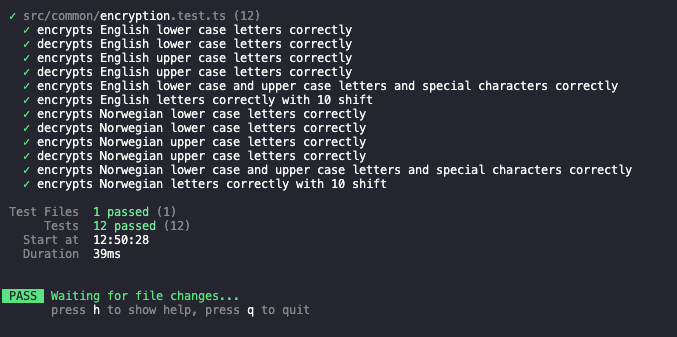

# Simple Encryption Web Application

This is a simple encryption web application. 
It supports two languages: Norwegian and English. 
This decision was made because Norwegian has 3 extra leters and they are treated as a special character in English and basically are ignored by the algorithm. 

Though in Norwegian mode, the three extra alphabet characters (Æ Ø Å) are counted and used in the algorithm. 


## Quick START

Open the application folder within a terminal. Then run the following commands. These commands will install the required dependecies by yarn and starts the app. 
```bash
yarn
yarn start
```

## Test

Some test cases have been written for this app and you can run them by writing this script in the termianl: 
```
yarn test
```



## SPECIFICATIONS

- Created with: 
  - Typescript + React. 

- The user can encrypt a text 
- The user can decrypt a text

## TESTS

- All functionality is tested with the [React testing library](https://testing-library.com/).


## React + TypeScript + Vite

This template provides a minimal setup to get React working in Vite with HMR and some ESLint rules.

Currently, two official plugins are available:

- [@vitejs/plugin-react](https://github.com/vitejs/vite-plugin-react/blob/main/packages/plugin-react/README.md) uses [Babel](https://babeljs.io/) for Fast Refresh
- [@vitejs/plugin-react-swc](https://github.com/vitejs/vite-plugin-react-swc) uses [SWC](https://swc.rs/) for Fast Refresh

